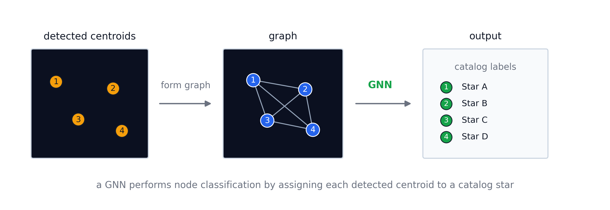
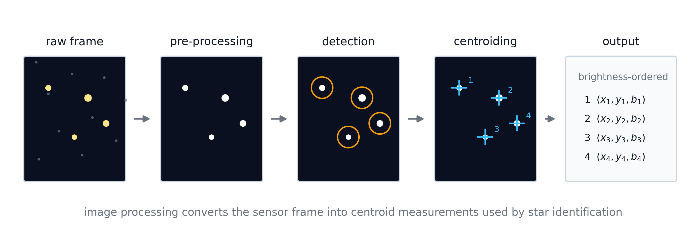
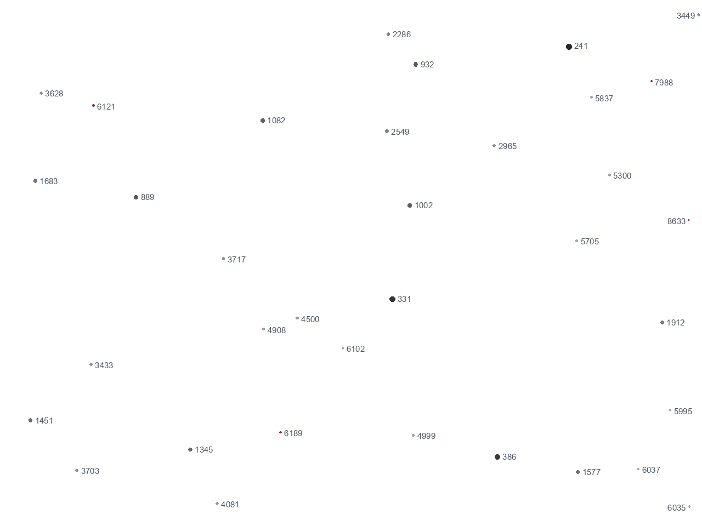
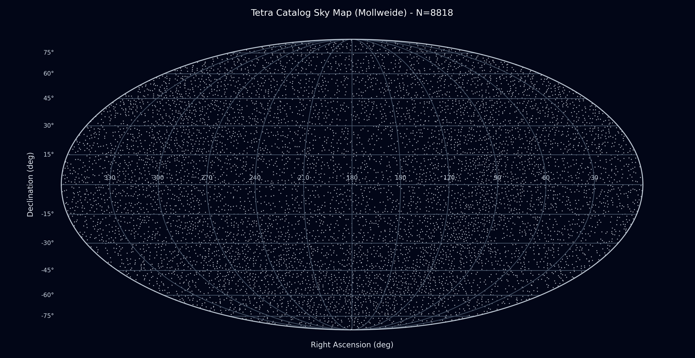
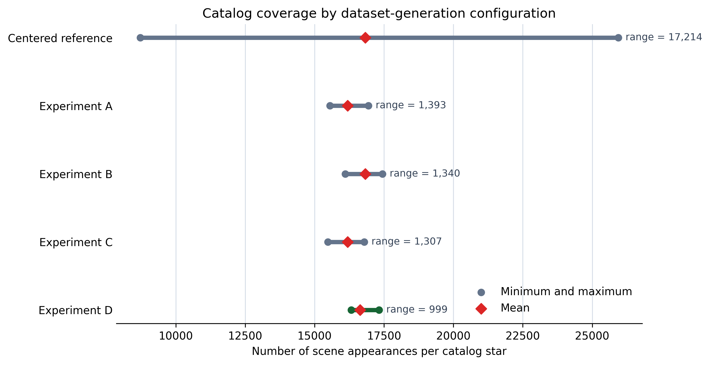
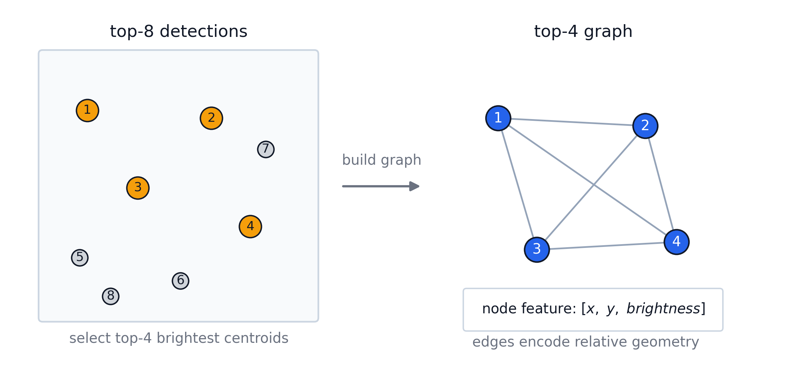

# Deep learning enabled star tracker — Tetra3 + GNN

> Master's dissertation · **Gonçalo Bessa Costa** · FCUP / FEUP, 2026
> Supervisors: Prof. Paulo Jorge Valente Garcia · Prof. Jaime dos Santos Cardoso

<p align="center">
  
</p>

This repository contains the code, configuration and result artifacts for a
dissertation that replaces **one stage** of the Tetra3 lost-in-space star
identification pipeline — the candidate-generation stage, i.e. the
tolerance-expanded hash lookup — with a **graph neural network (GNN)**, while
leaving Tetra3's centroid extraction and final geometric verification unchanged.
The GNN is not a standalone identifier: it proposes, for each detected centroid,
a short ordered list of catalogue candidates, and the geometric verification of
Tetra3 remains the final acceptance criterion. The goal is not to replace Tetra3
but to make its candidate-generation stage more selective — fewer hypotheses and
geometric verifications, and lower latency — while preserving its reliability.

**At a glance — on 147 real star-tracker images, the hybrid pipeline:**

- **matches** the classical Tetra3 coverage (**132 / 147 images solved**);
- needs, in the median, a **single** complete geometric verification per image
  instead of about **180** — a **180× reduction** in the most expensive step;
- runs roughly **2.3× faster** overall, at the **same** attitude.

---

## The problem

A star tracker estimates a spacecraft's absolute orientation from the star
pattern in its field of view, through three blocks: image processing, star
identification (in *lost-in-space* mode), and attitude determination. Image
processing reduces the raw frame to a brightness-ordered set of detected
centroids — the starting point of this work.

<p align="center">
  
</p>

Profiling the classical Tetra3 on real images shows that, after centroid
extraction, the runtime is overwhelmingly dominated by **identification**, and
within it by the **geometric validation** of the many candidate patterns the
tolerance-expanded hash lookup produces. That validation is the stage this work
makes more selective.

## How it works

### 1 · A synthetic dataset at the centroid level

A *scene* is not a photorealistic image but the set of detections that would
fall within the camera's field of view for a given attitude — the expected
output of the centroiding stage. Scenes are generated over the **same 8818-star
catalogue** Tetra3 uses, for a `1280 × 960` sensor with a `17.2° × 13.0°` field
of view, with realistic per-scene perturbations (0–5 false detections, 0–5
dropped stars, sub-pixel positional noise).

<p align="center">
  
  &nbsp;&nbsp;
  
</p>

Boresights are drawn uniformly over the celestial sphere, and a coverage band
caps already-frequent stars. This collapses the catalogue-coverage imbalance by
more than an order of magnitude (range `17214 → 999`), so every star is learned
roughly equally often.

<p align="center">
  
</p>

### 2 · Identification as node classification

Detected centroids become graph **nodes**; their pairwise geometry becomes
**edges**; the GNN labels each node with a catalogue star. The network is
deliberately minimal — a single message-passing step (an ordered concatenation
of each node's neighbours and the connecting edge distances) followed by a
multilayer perceptron. The single discriminative feature is the **centroid
distance normalised by the sensor diagonal**: a fixed reference, identical in
every scene, which is what carries the model from synthetic scenes to real
images. Magnitude is deliberately discarded — the uncalibrated gap between
catalogue magnitude and real instrumental flux makes it unreliable.

<p align="center">
  
</p>

The final formulation (**R3**) feeds the model variable-size graphs — the top-4
to top-8 brightest centroids per scene — which transfers best to the variable
number of usable stars a real image provides.

### 3 · A verified candidate generator inside Tetra3

The GNN never decides on its own. Two confident identities are enough to fix the
full attitude (Wahba's problem via SVD); that attitude is then submitted to the
**same** geometric verification Tetra3 already applies, so any accepted solution
is geometrically validated regardless of where the candidates came from. The
anchor-pair search is aligned with Tetra3's operating point
(`M = 8, N = 8, K = 10, B = 65`).

## Results

On the 147 real star-tracker images (classical Tetra3 as the reference):

| Pipeline | Solved (of 147) | Median complete geometric verifications | Median time / image |
|---|:---:|:---:|:---:|
| Classical Tetra3 | **132** | 180 | 150 ms |
| **Tetra3 + GNN** (R3) | **132** | **1** | **61 ms** |

The hybrid pipeline reaches the **same coverage** while collapsing the expensive
geometric work from ~180 verifications to a single one per solved image, and the
two pipelines agree on the recovered attitude (median pointing separation
`0.005°`). Training on **realistic** (rather than idealised) scenes is what
closes the synthetic-to-real gap.

---

## Reproducing the pipeline

Synthetic dataset generation, the closed-set split, GNN training, synthetic
evaluation and the classical-vs-hybrid comparison on real images all run from a
single entry point:

```bash
./scripts/reproduce_thesis_pipeline.sh smoke   # wiring check on a workstation
./scripts/reproduce_thesis_pipeline.sh full    # thesis-scale run (HPC)
```

The `smoke` mode builds a small synthetic dataset, creates the split, trains the
final R3 graph formulation for one epoch and evaluates it; it checks that the
pipeline is correctly wired, not that it reproduces the thesis-scale numbers. The
`full` mode regenerates the thesis dataset and trains the final model from the
recorded seeds, and is HPC-scale. The exact numbers behind the result tables are
committed under [`results/`](results/) and can be re-checked without re-running
the HPC pipeline.

If a trained checkpoint already exists, the real-image comparison can be run on
its own:

```bash
export CHECKPOINT=/path/to/best_checkpoint.pt
export REAL_IMAGE_ROOT=/path/to/imgs_teste
./scripts/reproduce_thesis_pipeline.sh eval-real
```

## Final configuration

The canonical configuration is recorded in
[`configs/final_r3_synthd.yaml`](configs/final_r3_synthd.yaml) and matches
Chapter 4 of the dissertation.

**Dataset (Section 4.2).**

- Tetra3 `default_database.npz`: the 8818-star `star_table` (Section 4.2.1), so
  the model's classes are exactly the catalogue on which Tetra3 operates.
- Sensor: `1280 × 960` px; field of view `17.2°` horizontal, `13.0°` vertical,
  `21.0°` diagonal.
- Final `synthD`: random-boresight scenes with coverage control inside a band of
  the reference mean ± 500 appearances (Section 4.2.8).
- Per-scene perturbations: 0–5 false detections, 0–5 dropped real stars, and a
  per-point positional uncertainty between 0.25 and 1.0 px (Section 4.2.7).
- `point_magnitude` stores the catalogue magnitude; magnitude perturbation is
  disabled in the final dataset (hence the run name `run5_expD_all_rawmag`).
- Seeds: split/training `12345`; star-centred reference `6353103531848264806`;
  `synthD` `577215227560855758`.

**GNN (Section 4.3).**

- Regime R3: five graphs per scene, on the top-4 to top-8 brightest centroids.
- Fully connected graphs; `edge_mlp` backbone; 5 layers, hidden dimension 512,
  dropout 0.2.
- No node features; the single edge feature is the centroid distance normalised
  by the sensor diagonal.
- AdamW, learning rate `1e-3`, weight decay `1e-5`, gradient clipping `1.0`;
  early stopping on the validation loss with patience 40.

**Tetra3 + GNN integration (Section 4.4).**

- The GNN only generates attitude hypotheses; centroid extraction and the final
  geometric verification remain Tetra3's.
- Anchor-pair search: `M = 8` brightest centroids, `N = 8` anchors, `K = 10`
  candidates per anchor, `B = 65` complete geometric verifications.

## Repository layout

| Path | Contents |
|---|---|
| [`tetra3/`](tetra3/) | Classical Tetra3 plus `tetra4_GNN.py`, the integrated anchor-pair-search variant. |
| [`synth_dataset/`](synth_dataset/) | Synthetic dataset generation, plus the real-vs-scene fidelity check. |
| [`GNN/`](GNN/) | GNN training, evaluation and the closed-set split. |
| [`scripts/`](scripts/) | The reproduction entry point and the classical-vs-hybrid comparison. |
| [`results/`](results/) | The small result files behind the thesis tables, verified against the dissertation. |
| [`experiments_archive/`](experiments_archive/) | Non-pipeline supporting material kept for traceability. |

## Real images & external artifacts

The 147 real star-tracker images are **proprietary** and are not required for the
`smoke` check. The multi-GB datasets and the trained checkpoints are catalogued
in [`ARTIFACTS.md`](ARTIFACTS.md); the datasets are fully regenerable from the
recorded seeds.

## Environment

The classical Tetra3 dependencies are in
[`requirements.txt`](requirements.txt); the GNN training path additionally
requires the packages listed in [`GNN/requirements.txt`](GNN/requirements.txt).
The full dataset generation and training are HPC-scale, whereas the `smoke`
pipeline is the recommended first check on a normal workstation.
